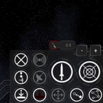

All Plugins (9)

[Cheats](https://github.com/zuckung/plugin-archive/blob/main/res/mds/cheats.md) (2) | [Gameplay](https://github.com/zuckung/plugin-archive/blob/main/res/mds/gameplay.md) (2) | [Graphics](https://github.com/zuckung/plugin-archive/blob/main/res/mds/graphics.md) (2) | [Outfits](https://github.com/zuckung/plugin-archive/blob/main/res/mds/outfits.md) (0) 
[Overhauls](https://github.com/zuckung/plugin-archive/blob/main/res/mds/overhauls.md) (0) | [Overwrites](https://github.com/zuckung/plugin-archive/blob/main/res/mds/overwrites.md) (0) | [Patches](https://github.com/zuckung/plugin-archive/blob/main/res/mds/patches.md) (0) | [Races](https://github.com/zuckung/plugin-archive/blob/main/res/mds/races.md) (2) 
[Ships](https://github.com/zuckung/plugin-archive/blob/main/res/mds/ships.md) (0) | [Story](https://github.com/zuckung/plugin-archive/blob/main/res/mds/story.md) (1) | [Weapons](https://github.com/zuckung/plugin-archive/blob/main/res/mds/weapons.md) (0) | [Uncategorized](https://github.com/zuckung/plugin-archive/blob/main/res/mds/uncategorized.md) (0) 

---

## Graphics

2 plugins in this category.

 

---

### additional.command.buttons
</img> 

[additional.command.buttons.zip](https://github.com/zuckung/plugin-archive/releases/download/Latest/additional.command.buttons.zip) | 17.65 kb | 2024-10-23 | [view files](https://github.com/zuckung/plugin-archive/tree/main/Working/additional.command.buttons/)  
Author: zuckung | Category: Graphics  
[https://github.com/zuckung/endless-sky-plugins](https://github.com/zuckung/endless-sky-plugins) (last commit 2024-06-07)  

>Made for the mobile version and adds several new buttons to the lower right corner. See the readme for details.
>(inspired by theweirednut)
>
>

:blue_book: Plugin readme

<blockquote>### additional.command.buttons  
 
Made for the mobile version and changes the interface by adding the following 10 buttons:   
<ul>
<li>full stop</li>
<li>board ship</li>
<li>land on planet</li>
<li>fleet: harvest flotsam</li>
<li>fleet: hold position</li>
<li>fleet: gather around me</li>
<li>fleet: attack my target</li>
<li>fleet: toggle ammo usage</li>
<li>view player info</li>
<li>fast forward</li>
</ul>
and
<ul>
<li>adjusts the message box to not overlap</li>
<li>moved the hidden ammo box to a visible place</li>
</ul>
 
(inspired by theweirednut)  
 

 
Allthough most of these commands are now implemented in other parts to the original mobile user interface or can be accessed by gestures, I personally prefer these buttons on the lower right corner. 
 
Additional there are some functions in this plugin that the original mobile ui can't do at the moment: 
- board button cycles through the possibilities  
- fleet commands can be used for single ships when selected  
 
This plugin overwrites `interface "main buttons"` and `interface "hud"`, so it isn't compatible with other plugins modifying these. 
 
 
Changelog: 
 
2024-06-07 
text corrections (thx to TheGiraffe3) 
 
2024-02-20 
re-added the ammo box to main buttons (latest mobile game version needed) 
 
2023-10-17 
added plugin.txt 
 
2023-08-24 
fixed non-firing attack button 
 
2023-08-05 
moved the hidden ammo box to a visible place 
 
2023-08-02 
added new icon and reworked readme 
 
2023-07-26 
added 3 more buttons to a total of 10 
added descriptions inside script to exchange buttons functions 
 
2023-07-06 
changed 'fire afterburner' to new 'fleet: harvest flotsam', because afterburner can easily toggled by double tapping 

</blockquote>

Status: DEPRECATED, continued in plugin "additional.command.buttons.radial"  
Daily update check: </img> 

---

### additional.command.buttons.radial
</img> 

[additional.command.buttons.radial.zip](https://github.com/zuckung/plugin-archive/releases/download/Latest/additional.command.buttons.radial.zip) | 166.73 kb | 2024-10-16 | [view files](https://github.com/zuckung/plugin-archive/tree/main/Working/additional.command.buttons.radial/)  
Author: zuckung | Category: Graphics  
[https://github.com/zuckung/endless-sky-plugins](https://github.com/zuckung/endless-sky-plugins) (last commit 2024-10-15)  

>Made for the MOBILE ANDROID version. Adds several new buttons to the lower right corner. See the README for details.
>
>

:blue_book: Plugin readme

<blockquote>### additional.command.buttons  
 
Reworks the main buttons ui on the lower right side. Made for the ANDROID version of ES.  
 
 
This plugin 
- rearranges and resizes some of the buttons 
- changes most icons (making a ring around as a standard)
- adds more permanent buttons from the radial menus to make them easy accessible 
- removes the radial menus 
- adds a new button row to the top right for the fleet commands 
- adds zoom buttons
- greyes out inactive buttons 
- puts images behind the buttons. 

 
 
 
Changelog: 
 
2024-10-11 
added fleet formations button 
 
2024-10-07 
added fleet hold fire button 
 
2024-09-06 
fine tuning for the graphics 
 
2024-09-02 
fixed button radius typo on fleet gather 
moved the fleet commands to the right side, so the jump systems are better seen 
 
2024-08-31 
changed button background to look more natural 
 
2024-08-30 
fixed an error 
adjusted positions 
added zoom buttons 
all buttons are visible now, but greyed out if you can't use them 
reworked all buttons to display a ring around them 
resized the fast forward button in the upper left corner, and added a greyed out version 
 
2024-08-25 
added a new panel for the fleet commands to the top center 
reworked the toggle ammo button 
removed the expandable radial menus, because all buttons are on the screen now 
exchanged some of the button positions 
 
2024-05-09 
initial release 
</blockquote>

Status: complete  
Daily update check: </img> 

[back to top](https://github.com/zuckung/plugin-archive/blob/main/res/mds/gameplay.md#gameplay)

