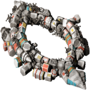

All Plugins (9)

[Cheats](https://github.com/zuckung/plugin-archive/blob/main/res/mds/cheats.md) (2) | [Gameplay](https://github.com/zuckung/plugin-archive/blob/main/res/mds/gameplay.md) (2) | [Graphics](https://github.com/zuckung/plugin-archive/blob/main/res/mds/graphics.md) (2) | [Outfits](https://github.com/zuckung/plugin-archive/blob/main/res/mds/outfits.md) (0) 
[Overhauls](https://github.com/zuckung/plugin-archive/blob/main/res/mds/overhauls.md) (0) | [Overwrites](https://github.com/zuckung/plugin-archive/blob/main/res/mds/overwrites.md) (0) | [Patches](https://github.com/zuckung/plugin-archive/blob/main/res/mds/patches.md) (0) | [Races](https://github.com/zuckung/plugin-archive/blob/main/res/mds/races.md) (2) 
[Ships](https://github.com/zuckung/plugin-archive/blob/main/res/mds/ships.md) (0) | [Story](https://github.com/zuckung/plugin-archive/blob/main/res/mds/story.md) (1) | [Weapons](https://github.com/zuckung/plugin-archive/blob/main/res/mds/weapons.md) (0) | [Uncategorized](https://github.com/zuckung/plugin-archive/blob/main/res/mds/uncategorized.md) (0) 

---

## Races

2 plugins in this category.

 

---

### Core Mining Inc
</img> 

[Core.Mining.Inc.zip](https://github.com/zuckung/plugin-archive/releases/download/Latest/Core.Mining.Inc.zip) | 310.98 kb | 2024-10-23 | [view files](https://github.com/zuckung/plugin-archive/tree/main/Working/Core%20Mining%20Inc/)  
Author: DJF113 | Category: Races  
[https://github.com/DJF113/Core-Mining-Inc](https://github.com/DJF113/Core-Mining-Inc) (last commit 2024-10-03)  

>The Core Mining, Inc. plugin gives you the chance to follow the progress of a small startup mining company. The storyline is designed to fit in with the feel of the vanilla game. The story and plugin itself is not finished yet so you may find bugs, glitches, and other problems.
>

:blue_book: Plugin readme

<blockquote>Thanks for trying out the Core Mining, Inc. mod! The items below should give you a little bit
of an idea of what the mod is about and where I plan to go with it. I also have installation
instructions and the changelog as well.

   ___________________________________________________________________________
  |:..                                                           ``:::%%%%%%HH|
  |%%%:::::..                   Table of Contents                   `:::::%%%%|
  |HH%%%%%:::::.....____________________________________________________::::::|

1. About the Mod
2. Installation Instructions
3. Tips
4. Versions and Bug Fixes
5. Known Issues

1. About the Mod
	The Core Mining, Inc. mod adds a storyline that offers you the chance to work for a newly
started company called Core Mining. You start with them from the very beginning and help build
up the company. Along the way, you can make different choices which may impact the game at a
later time, as well as potentially make major changes to the plotline. Not everything is in
place yet, but I'm hoping to make a plugin that fits in seamlessly with the vanilla game.
There is a major alternate story that goes with the main one that still needs to be written
and I also would like input on the difficulty of the missions as well as typos and glitches
in the mod. Any other suggestions on the overall flow and quality of the mod are appreciated
as well.
						Thanks for reading, and enjoy!
													DJF113

2. Installation Instructions

	for Microsoft Windows
		1. Download the "Core Mining, Inc." mod
		2. Extract folder "Core Mining, Inc" into the Endless Sky plugins folder:
		   C:\Users\"your username"\AppData\Roaming\endless-sky\plugins
		   You will have to select "show hidden files and folders" in the folder options
		   menu to find the AppData folder unless you have already done so.

3. Tips

	The first mission is offered within two jumps of the Delta Capricorni system, and won't
		trigger until after 4 June 3014.
	
	I normally start the mod with a Berserker, then use the money you make to work my way up
		from there. Not everything is set in stone at the moment, but it's going to be easier
		to use that than a Sparrow!

4. Versions and Bug Fixes

-0.0.1-
	Started the Alpha version of Core Mining, Inc. by writing the first five missions into
		the CMI Part 1 file. I also created a temporary start file for the first stages of
		testing. This will be deleted later on and the first mission will not be offered on
		Maker every time. Also started the following files: events, fleets, governments, and
		names; all containing customized things for the mod. None of the info in these files
		will be used until CMI Part 2 though.

-0.0.2-
	Fixed some spelling errors and (hopefully) improved some of the mission dialogue.
		Hopefully more improvements in the dialogue coming soon.

-0.0.3-
	Finished the last two missions of the CMI Part 1 file. Players will now receive a 5000
		credit salary after completing the seventh mission. (Salary subject to change later
		on.) Working on a problem with the player swizzle not changing. Also added an icon
		and description that will show up on the plugins screen.

-0.0.4-
	Added all seven of the missions in the CMI Part 2 file. Mission #'s are: 8A, 8B, 9, 10A,
		10B, 11, and 12. A little bit more work with the events and fleets file, some of which
		will not be used until later on. I have not figured out anything with the swizzle
		problem yet. I may have to do some research on it.

-0.1.0-
	The Core Mining, Inc. mod is now version 0.1! The changes in this version were mostly
		spelling mistakes and an issue where the pirate fleet was twice the size I wanted it.
		I decided to move from Alpha to Beta since the basic testing and parts one and two of
		the storyline are finished. I have the general ideas for parts three, four, and five
		and some more ideas as well...

-0.1.1-
	Wrote all seven missions in the CMI Part 3 file. Several more events added, including one
		that slows down the amount of Korath Raids in the Durax system during mission 19.

-0.1.2-
	Just fixed a few spelling errors and some minor bugs that cropped up from version 0.1.1.

-0.1.3-
	Finished writing and added all of the missions in the CMI Part 4 file. You will also
		notice a CMI Part 5 file. This only has one mission at this point as it was written to
		test the final mission in the Part 4 string. I've also renamed all of the missions so
		you will either have to create new savegames or do some editing to your save file to
		keep playing your current savegame. The reason for the renaming is to make inserting
		missions at a later point easier.

-0.1.4-
	The CMI storyline will now no longer be available if you have played very far into the
		Free Worlds story. The specific event is "chosen sides", set once you have decided to
		join up with them. Also all of the missions are no longer in the "CMI Part" files, but
		in the "CMI Section" files. Parts 1-4 are in the Section 1 file and Parts 5-? will be
		in the Section 2 file once they are completed. It's not too many changes for the version,
		but I feel it cleans things up considerably.

-0.1.5-
	Removed the map file from the mod because of overlap with version 0.9.8 of Endless Sky.
		Finished and tested the missions in the CMI S2 Part 1 and CMI S2 Part 2 file.

-0.1.6-
	Changed the icon that shows up in the mod list. Added the "Tips" section to the readme
		file. Added Autosave feature to all missions. Wrote the CMI S2 Part 3, and Part 4 file,
		then combined them with parts 1 and 2 into the CMI Section 2 file. Designed an Under
		Construction mission that should (hopefully!) make it easier to get the next mission
		once an update comes out. CMI S3 Part 1 only contains the Under Construction mission.

-0.1.7-
	Fixed an issue where I forgot to add ship names for some of the npcs. Fixed a bug
		mentioned by Der_König where the destination name was wrong. Added a proof of concept
		CMI transport mission, and a mission that shows up when the new fusion reactor is
		available. Fixed an issue with the CMI reactor thumbnail not working. Also added several
		events that inject CMI into the game, even when the storyline has not been used in a
		playthrough. Multiple other bug fixes. Finished Section 3 of the main branch of the
		storyline, and started work on Section 4 as well. Made some changes to the bounty
		hunting mission, which included lowering the level of the nemesis ship, and giving you
		an unmarked escort. Added landscape to Keselrig.

-0.1.8-
	Very small update fixing a bug where a mission wouldn't show up.

5. Known Issues

	It's not finished! :-)
	Missions do not have passenger and freight quantities set yet. (This should be inserted
		once the storyline is closer completion.)
	Combat missions tend to not be balanced.

</blockquote>

Status: playable on 0.9.15 Continuous.  
Daily update check: </img> 

---

### Swiftclaws.additional.command.buttons
</img> 

[Swiftclaws.additional.command.buttons.zip](https://github.com/zuckung/plugin-archive/releases/download/Latest/Swiftclaws.additional.command.buttons.zip) | 43.77 kb | 2024-10-23 | [view files](https://github.com/zuckung/plugin-archive/tree/main/Working/Swiftclaws.additional.command.buttons/)  
Author: swiftclaw | Category: Races  
[https://drive.google.com/file/d/17RstjG7nxM0KzhfwpVh50NrgCO9cQ375/view](https://drive.google.com/file/d/17RstjG7nxM0KzhfwpVh50NrgCO9cQ375/view) (last commit 2024-06-07)  

>Modified version of additional.command.buttons plugin
>
>

:blue_book: Plugin readme

<blockquote>### automata.destruction.0percent
 
 
Modifies the self destruction chance of Sestor and Mereti ships to a value of 0.0 (0%). 
 
Sestor 349/109/78/71/53/27/14 and Mereti 512/256/128/64/32/16/8 ships have a self destruction value of 0.0 (0%) now. 
You can easily change the values in automata.txt for each ship ('"self destruct" .0') to a value of your choice. I.e. 0.12 is 23%, 0.3 is 51%, 0.5 is 75%. Its calculated twice, first the chance for self destruction on boarding(i.e. 0.3) is 30%, then of the remaining 70% again 30% chance for self destruction on capturing. That makes 30% + 21% = 51% overall chance for self destruction on a capturing try. 
 
 
Changelog: 
 
2024-06-07 
text corrections (thx to TheGiraffe3) 
 
2023-10-17 
added plugin.txt 
 
2023-09-07 
changed icon 
changed about.txt 
changed readme 

</blockquote>

Status: tested with 0.10.2  
Daily update check: </img> 

[back to top](https://github.com/zuckung/plugin-archive/blob/main/res/mds/Races.md#graphics)

